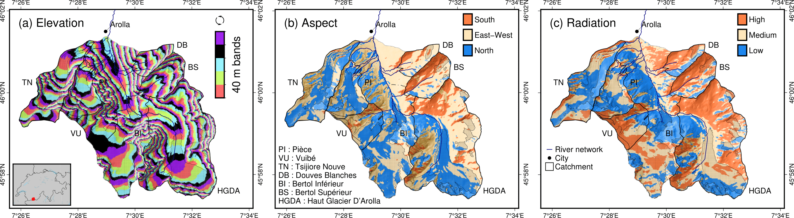

.. _basics:

The basics
==========

Model structure
---------------

A model is composed of three main elements: bricks, processes, and fluxes.
The bricks are any component that can contain water, such as a snowpack, a glacier,
or a ground reservoir. They can contain one or more water containers.
For example, the snowpack has a snow and a liquid water container.
These bricks are assigned with processes that can extract water.
Processes are for example snowmelt, evapotranspiration (ET), or outflow according to the behaviour.
The water extracted from the bricks by the processes are then transferred to fluxes,
which deliver it to other bricks, the atmosphere, or the outlet.

For now, only pre-built structures are available.
One can create a pre-built instance of a model by using the provided class (to be
considered as the blueprint) with some options.
The options and the existing models are detailed in the :ref:`models page <models>`.

.. code-block:: python

   socont = models.Socont(soil_storage_nb=2)

.. _spatial-structure:

Spatial structure
-----------------

The catchment is discretized into sub units named hydro units.
These hydro units can represent HRUs (hydrological response units), pixels,
elevation bands, etc. They can be either loaded from a file or generated from a DEM
based on topography, aspect and radiation.

   (b) aspect, and (c) radiation. Aspect and radiation discretizations are
   then combined with elevation bands to form HRUs.
   Argentin, Horton, et al. (2025) https://doi.org/10.5194/hess-29-1725-2025
   :width: 600px
   :align: center

Loading hydro units from a csv file
^^^^^^^^^^^^^^^^^^^^^^^^^^^^^^^^^^^

The hydro units properties can be loaded from csv files containing at minimum data on each 
unit area and elevation (mean elevation of each hydro unit).
Loading such a file can be done as follows:

.. code-block:: python

   hydro_units = hb.HydroUnits()
   hydro_units.load_from_csv(
      'path/to/file.csv', column_elevation='elevation', column_area='area')

The csv file containing the hydro units data needs to have two header rows: 
first row with the column name, second with the units.
It can look like the following example.

.. code-block:: text
   :caption: Example of a simple csv file with the hydro units area.

   num, elevation, area
   -,m,m^2
   0, 790, 2457500
   1, 840, 4481250
   2, 890, 5630625
   3, 940, 5598125
   4, 990, 4551250
   5, 1040, 4579375
   6, 1090, 4128125
   7, 1140, 4807500
   8, 1190, 4643750
   9, 1240, 4662500
   10, 1290, 4158750
   11, 1340, 3496875
   12, 1390, 2361250

The default land cover is named ``ground`` and it has no specific behaviour.
When there is more than one land cover, these can be specified.
Each hydro unit is then assigned a fraction of the provided land covers
For example, for a catchment with a pure ice glacier and a debris-covered glacier, one
then needs to provide the area for each land cover type and for each hydro unit
(more information in :ref:`the Python API <api_hydrounits>`):

.. code-block:: python

   land_cover_names = ['ground', 'glacier_ice', 'glacier_debris']
   land_cover_types = ['ground', 'glacier', 'glacier']

   hydro_units = hb.HydroUnits(land_cover_types, land_cover_names)
   hydro_units.load_from_csv(
      'path/to/file.csv', column_elevation='Elevation',
      columns_areas={'ground': 'Area Non Glacier',
                     'glacier_ice': 'Area Ice',
                     'glacier_debris': 'Area Debris'})

The csv file containing the hydro units data needs to have two header rows: 
first row with the column name, second with the units.
It can look like the following example.

.. code-block:: text
   :caption: Example of a csv file with the hydro units area for different land cover types.

   Elevation, Area Non Glacier, Area Ice, Area Debris
   m, km2, km2, km2
   3986, 2.408, 0, 0
   4022, 2.516, 0, 0
   4058, 2.341, 0, 0.003
   4094, 2.351, 0, 0.006
   4130, 2.597, 0, 0.01
   4166, 2.726, 0, 0.006
   4202, 2.687, 0, 0.061
   4238, 2.947, 0, 0.065
   4274, 2.924, 0.013, 0.06
   4310, 2.785, 0.019, 0.058
   4346, 2.578, 0.052, 0.176
   4382, 2.598, 0.072, 0.369
   4418, 2.427, 0.129, 0.384
   4454, 2.433, 0.252, 0.333
   4490, 2.210, 0.288, 0.266
   4526, 2.136, 0.341, 0.363
   4562, 1.654, 0.613, 0.275

Generating hydro units from a DEM
^^^^^^^^^^^^^^^^^^^^^^^^^^^^^^^^^

The hydro units can also be generated automatically from the topography, the aspect
and the radiation.

Discretizing by elevation is sufficient for the melt model ``'degree_day'``, but a 
discretization by elevation and aspect is required when using the melt model 
``'degree_day_aspect'`` and a discretization by elevation and radiation is reauired
for the melt model ``'temperature_index'``.

For example, to discretize the study area spanning an elevation range of 1900 m to
2900 m into elevation bands of 40 m of height and aspect categories, we use: 

.. code-block:: python
   
   study_area = catchment.Catchment(outline='path/to/watershed/shapefile.shp')
   success = study_area.extract_dem('path/to/dem.tif')
   study_area.discretize_by(['elevation', 'aspect'], 
                            elevation_method='equal_intervals', 
                            elevation_distance=40,
                            min_elevation=1900, 
                            max_elevation=2900, 
                            )

We recommand that the glacier spans 10 elevation bands. This gives a hint for 
the optimal elevation band height. 

Computing the radiation for discretization
^^^^^^^^^^^^^^^^^^^^^^^^^^^^^^^^^^^^^^^^^^

The daily mean potential clear-sky direct solar radiation is computed at the 
DEM surface [W/m²] using Hock (1999)'s equation. By default, the radiation
resolution will be the DEM resolution. If you use a high resolution DEM, make sure
to set a lower resolution for the radiation, as it will be computationnally expensive.

.. code-block:: python
   
   study_area = catchment.Catchment(outline='path/to/watershed/shapefile.shp')
   success = study_area.extract_dem('path/to/dem.tif')
   study_area.calculate_daily_potential_radiation('path/to/file', resolution)

Since the radiation computation takes a few minutes and is not year-specific, it can 
also be saved and loaded back in memory. By default, the name of the radiation file
will be ``'annual_potential_radiation.tif'`` and can be omitted.

.. code-block:: python

   study_area = catchment.Catchment(outline='path/to/watershed/shapefile.shp')
   success = study_area.extract_dem('path/to/dem.tif')
   study_area.load_mean_annual_radiation_raster('path/to/file', filename='annual_potential_radiation.tif')

The radiation can then be used to discretize the catchment:

.. code-block:: python

   study_area.discretize_by(['elevation', 'radiation'],
                            elevation_method='equal_intervals', 
                            elevation_distance=40,
                            min_elevation=1900, 
                            max_elevation=2900, 
                            radiation_method='equal_intervals', 
                            radiation_distance=65, 
                            min_radiation=0, 
                            max_radiation=260)

.. _parameters:

Parameters
----------

The parameters are managed as parameter sets in an object that is an instance of the
``ParameterSet`` class.
It means that there is a single variable containing all the parameters for a model.
Within it, different properties are defined for each parameter
(more information in :ref:`the Python API <api_parameterset>`):

* **component**: the component to which it refers to (e.g., glacier, slow_reservoir)
* **name**: the detailed name of the parameter (e.g., degree_day_factor)
* **unit**: the parameter unit (e.g., mm/d/°C)
* **aliases**: aliases for the parameter name; this is the short version of the
  parameter name (e.g., a_snow)
* **value**: the value assigned to the parameter
* **min**: the minimum value the parameter can accept
* **max**: the maximum value the parameter can accept
* **default_value**: the parameter default value; only few parameters have default
  values, such as the melting temperature, and these are usually not necessary to
  calibrate
* **mandatory**: defines if the parameter value needs to be provided by the user
  (i.e. it has no default value)
* **prior**: prior distribution to use for the calibration.
  See :ref:`the calibration page <calibration>`

Creating a parameter set
^^^^^^^^^^^^^^^^^^^^^^^^

When using a pre-build model structure, the parameters for this structure can be
generated using the ``model.generate_parameters()`` function.
For example, the following code creates a definition of the Socont model structure and
generates the parameter set for the given structure, accounting for the options, such
as the number of soil storages. Within this parameter set, the basic attributes are
defined, such as the name, aliases, units, min/max values, etc.

.. code-block:: python

   socont = models.Socont(soil_storage_nb=2)
   parameters = socont.generate_parameters()

Assigning the parameter values
^^^^^^^^^^^^^^^^^^^^^^^^^^^^^^

To set parameter values, the ``set_values()`` function of the parameter set can be used
with a dictionary as argument. The dictionary can use the full parameter names
(e.g. ``snowpack:degree_day_factor`` with no space), or one of the aliases
(e.g., ``a_snow``):

.. code-block:: python

   parameters.set_values({'A': 100, 'k_slow': 0.01, 'a_snow': 5})

Parameter constraints
^^^^^^^^^^^^^^^^^^^^^

Some constraints can be added between parameters. Some of these are built-in when the
parameter set is generated and are described in the respective model description.
For example, in GSM-Socont, the degree day for the snow must be inferior to the one for
the ice (``a_snow < a_ice``).

Constraints between parameters can be added by the user as follows:

.. code-block:: python

   parameters.define_constraint('k_slow_2', '<', 'k_slow_1')

The supported operators are: ``>`` (or ``gt``), ``>=`` (or ``ge``), ``<`` (or ``lt``),
``<=`` (or ``le``).

On the contrary, pre-defined constraints can be removed:

.. code-block:: python

   parameters.remove_constraint('a_snow', '<', 'a_ice')

Parameter ranges
^^^^^^^^^^^^^^^^

The parameters are usually generated with a pre-defined range.
This range is used to ensure that a provided value falls within the authorized range
and to define the boundaries for the calibration algorithm.
The pre-defined ranges can be changed as follows:

.. code-block:: python

   parameters.change_range('a_snow', 2, 5)

Adding data-related parameters
^^^^^^^^^^^^^^^^^^^^^^^^^^^^^^

Data-related parameters target for example the spatialisation of the forcing data.
As these are not model-dependent, but data-dependent, they are not pre-defined by
the model and need to be added ba the user:

.. code-block:: python

   parameters.add_data_parameter('precip_corr_factor', 1, min_value=0.7, max_value=1.3)
   parameters.add_data_parameter('precip_gradient', 0.05, min_value=0, max_value=0.2)
   parameters.add_data_parameter('temp_gradients', -0.6, min_value=-1, max_value=0)

For the meaning of these parameters and the spatialisation procedures implemented in
hydrobricks, refer to the section on :ref:`forcing data<forcing-data>`.

It is also possible, for certain parameters, to define monthly values and ranges:

.. code-block:: python

   parameters.add_data_parameter(
       'temp_gradients',
       [-0.6, -0.6, -0.6, -0.6, -0.7, -0.7, -0.8, -0.8, -0.8, -0.7, -0.7, -0.6],
       min_value=[-0.8, -0.8, -0.8, -0.8, -0.8, -0.8, -0.8, -0.8, -0.8, -0.8, -0.8, -0.8],
       max_value=[-0.3, -0.3, -0.3, -0.3, -0.3, -0.3, -0.3, -0.3, -0.3, -0.3, -0.3, -0.3])

.. _forcing-data:

Forcing data
------------

The meteorological data is handled by the ``Forcing`` class.
It handles the spatialization of the weather data to create per-unit time series.
Therefore, when creating an instance of this class, the hydro units must be provided:

.. code-block:: python

   forcing = hb.Forcing(hydro_units)

Loading forcing data from a csv file
^^^^^^^^^^^^^^^^^^^^^^^^^^^^^^^^^^^^

The data, for example station time series, can the be loaded from csv files.
Multiple files can be loaded successively, or a single file can contain different
variables (as different columns).
One needs to specify which column contains the dates, their format, and which
column header represent what kind of variable.
For example (more information in :ref:`the Python API <api_forcing>`):

.. code-block:: python

    forcing.load_from_csv(
        'path/to/forcing.csv', column_time='Date', time_format='%d/%m/%Y',
        content={'precipitation': 'precip(mm/day)', 'temperature': 'temp(C)',
                 'pet': 'pet_sim(mm/day)'})

A csv file containing forcing data can look like the following example:

.. code-block:: text
   :caption: Example of a csv file containing forcing data.

   Date,precip(mm/day),temp(C),sunshine_dur(h),pet_sim(mm/day)
   01/01/1981,8.24,-0.98,0.42,0.58
   02/01/1981,4.02,-3.35,0.08,0
   03/01/1981,22.27,0.96,0.44,0.95
   04/01/1981,28.85,-2.11,0.08,0
   05/01/1981,8.89,-5.62,0.07,0.06
   06/01/1981,17.49,-4.72,0.09,0
   07/01/1981,8.26,-8.58,0.14,0
   08/01/1981,0.14,-11.47,81.73,0
   09/01/1981,0.91,-7.37,0.1,0.05
   10/01/1981,0.54,-3.23,0.09,0
   11/01/1981,0.02,-4.57,1.94,0
   12/01/1981,2.28,-4.01,69.95,0
   13/01/1981,7.03,-6.39,0.04,0
   14/01/1981,9.68,-7.54,73.98,0
   15/01/1981,16.23,-3.95,0.23,0.01
   16/01/1981,2.77,-7.28,0.18,0.19
   17/01/1981,6.49,-1.57,1.29,0.19
   18/01/1981,5.53,-3.7,0.07,0
   ...

Spatialization
^^^^^^^^^^^^^^

The spatialization operation needs to be specified to generate per-unit timeseries.
This definition needs information on the variable, the method to use and its parameters:

.. code-block:: python

   forcing.define_spatialization(
       variable='temperature', method='additive_elevation_gradient',
       ref_elevation=1250, gradient=-0.6)

As we might also want to calibrate the parameters for such operations, these can
also be specified as a reference to a parameter instead of a fixed value.
In such case, one must add a data parameter as in the following example:

.. code-block:: python

   forcing.define_spatialization(
       variable='temperature', method='additive_elevation_gradient',
       ref_elevation=1250, gradient='param:temp_gradients')

   parameters.add_data_parameter('temp_gradients', -0.6, min_value=-1, max_value=0)

The variables supported so far are: ``temperature``, ``precipitation``, ``pet``.
The methods and parameters are described in :ref:`the Python API <api_forcing>`.

Loading forcing data from a netcdf file
^^^^^^^^^^^^^^^^^^^^^^^^^^^^^^^^^^^^^^^

Forcing data can also be loaded from NetCDF files, that are very common in
the meteorological modeling field.

The function will go take all files matching the pattern (e.g., ``"RhiresD_ch01r.swisscors_*.nc"``)
in the netcdf folder. Here pattern means that the ``*`` can be replaced by any sequence
of characters (e.g., 1995, 1996, etc.), and allows to select a set of netcdf files.
All the files present in the folder will be loaded in the model. Remove non-necessary files 
for a quicker loading.

The CRS of the netcdf file is always indicated in EPSG code (https://epsg.io/).
The name of the variable to extract (e.g., 'RhiresD') and the dimensions of the dataset
in the x, y and time axis also need to be specified. We take here the example of the 
MeteoSwiss grid-data product for daily precipitation (version before 2022).

The hydro units are provided as tif file to be able to spatialize the netdf data.

.. code-block:: python

   forcing.spatialize_from_gridded_data(
       variable='precipitation', path='path/to/netcdf/folder', file_pattern="RhiresD_ch01r.swisscors_*.nc",
       data_crs=21781, var_name='RhiresD', dim_x='chx',
       dim_y='chy', dim_time='time', raster_hydro_units='unit_ids.tif')

.. _model-instance:

Running the model
-----------------

Once the :ref:`hydro units <spatial-structure>`, :ref:`parameters <parameters>` and
:ref:`forcing <forcing-data>` defined, the model can be set up and run:

.. code-block:: python

   socont.setup(spatial_structure=hydro_units, output_path='/path/to/dir',
                start_date='1981-01-01', end_date='2020-12-31')

   socont.run(parameters=parameters, forcing=forcing)

Then, the outlet discharge (in mm/d) can be retrieved:

.. code-block:: python

   sim_ts = socont.get_outlet_discharge()

More outputs can be extracted and saved to a netCDF file for further analysis:

.. code-block:: python

   socont.dump_outputs('/output/dir/')

The state variables can be initialized using the ``initialize_state_variables()``
function between the ``setup()`` and the ``run()`` functions.
The initialization runs the model for the given period and saves the final state variables.
These values are then used as initial state variables for the next run:

.. code-block:: python

   socont.initialize_state_variables(parameters=parameters, forcing=forcing)
   socont.run(parameters=parameters, forcing=forcing)

When the model is executed multiple times successively, it clears its previous states.
When the states initialization provided by ``initialize_state_variables()`` has been
used, the model resets its state variables to these saved values.

Evaluation
^^^^^^^^^^

Some metrics can be computed by providing the observation time series (in mm/d):

.. code-block:: python

   # Preparation of the obs data
   obs = hb.Observations()
   obs.load_from_csv('/path/to/obs.csv', column_time='Date', time_format='%d/%m/%Y',
                     content={'discharge': 'Discharge (mm/d)'})
   obs_ts = obs.data_raw[0]

   nse = socont.eval('nse', obs_ts)
   kge_2012 = socont.eval('kge_2012', obs_ts)

The metrics are provided by the `HydroErr package <https://hydroerr.readthedocs.io>`_ .
All the `metrics listed under their website <https://hydroerr.readthedocs.io/en/stable/list_of_metrics.html>`_
can be used and are named according to their function names.

Outputs
-------

The results can be accessed in different ways and with different levels of detail:

1. The `direct outputs`_ from the model instance.
2. A `dumped netCDF file`_ containing more details for each hydro unit.
3. :ref:`Other <others>` outputs such as the spatialized forcing or the SPOTPY outputs.

Direct outputs
^^^^^^^^^^^^^^

Some outputs from the model instance are available after a model run as long as the
Python session is still alive.
The first one is the discharge time series at the outlet, provided
by ``get_outlet_discharge()``:

.. code-block:: python

   sim_ts = model.get_outlet_discharge()

Some outputs provide integrated values over the simulation period:

* ``get_total_outlet_discharge()``: Integrated discharge at the outlet
* ``get_total_et()``: Integrated ET
* ``get_total_water_storage_changes()``: Changes in all water reservoirs between the
  beginning of the period and the end.
* ``get_total_snow_storage_changes()``: Changes in snow storage between the
  beginning of the period and the end.

Dumped netCDF file
^^^^^^^^^^^^^^^^^^

A detailed netCDF file can be dumped with ``model.dump_outputs('some/path')``.
The content of the file depends on the option ``record_all`` provided at model creation.
When True, all fluxes and states are recorded, which slows down the model execution.

The file has the following dimensions:

* ``time``: The temporal dimension
* ``hydro_units``: The hydro units (e.g., elevation bands)
* ``aggregated_values``: Elements recorded at the catchment scale (lumped)
* ``distributed_values``: Elements recorded at each hydro unit ([semi-]distributed)
* ``land_covers``: The different land covers

It contains three important global attributes:

* ``labels_aggregated``: The labels of the lumped elements (fluxes and states)
* ``labels_distributed``: The labels of the distributed elements (fluxes and states)
* ``labels_land_covers``: The labels of the land covers

For example, for the GSM-Socont model with two different glacier types provides
the following attributes:

.. code-block:: text

   labels_aggregated =
      "glacier-area-rain-snowmelt-storage:content",
      "glacier-area-rain-snowmelt-storage:outflow:output",
      "glacier-area-icemelt-storage:content",
      "glacier-area-icemelt-storage:outflow:output",
      "outlet";

   labels_distributed =
      "ground:content",
      "ground:infiltration:output",
      "ground:runoff:output",
      "glacier-ice:content",
      "glacier-ice:outflow-rain-snowmelt:output",
      "glacier-ice:melt:output",
      "glacier-debris:content",
      "glacier-debris:outflow-rain-snowmelt:output",
      "glacier-debris:melt:output",
      "ground-snowpack:content",
      "ground-snowpack:snow",
      "ground-snowpack:melt:output",
      "glacier-ice-snowpack:content",
      "glacier-ice-snowpack:snow",
      "glacier-ice-snowpack:melt:output",
      "glacier-debris-snowpack:content",
      "glacier-debris-snowpack:snow",
      "glacier-debris-snowpack:melt:output",
      "slow-reservoir:content",
      "slow-reservoir:et:output",
      "slow-reservoir:outflow:output",
      "slow-reservoir:percolation:output",
      "slow-reservoir:overflow:output",
      "slow-reservoir-2:content",
      "slow-reservoir-2:outflow:output",
      "surface-runoff:content",
      "surface-runoff:outflow:output";

   labels_land_covers =
      "ground",
      "glacier-ice",
      "glacier-debris";

Then, it provides the following variables:

* ``time`` (1D): The dates as Modified Julian Dates (days since 1858-11-17 00:00).
* ``hydro_units_ids`` (1D): The IDs of the hydro units.
* ``hydro_units_areas`` (1D): The area of the hydro units.
* ``sub_basin_values`` (2D): The time series of the aggregated elements
  (c.f. labels_aggregated)
* ``hydro_units_values`` (2D): the time series of the distributed elements
  (c.f. labels_distributed). Please not here the differences between:
   * the fluxes (mm), i.e. ``output`` elements are already weighted by the land cover
     fraction and the relative hydro unit area. Thus, these elements can be directly
     summed over all hydro units to obtain the total contribution of a given
     component (e.g., ice melt), even when the hydro units have different areas.
   * the state variables (mm) such as ``content`` or ``snow`` elements represent
     the water stored in the respective reservoirs. In this case, this value is not
     weighted and cannot be summed over the catchment, but must be weighted
     by the land cover fraction and the relative hydro unit area.
* ``land_cover_fractions`` (2D, optional): the temporal evolution of the land cover
  fractions.

Others
^^^^^^

Some other outputs are available:

- Dumbed forcing: the forcing object can also be saved as a netCDF file using the
  ``forcing.create_file()``. It thus contains the spatialized forcing time series.
- During the calibration procedure, SPOTPY saves all assessments in csv or sql tables.
