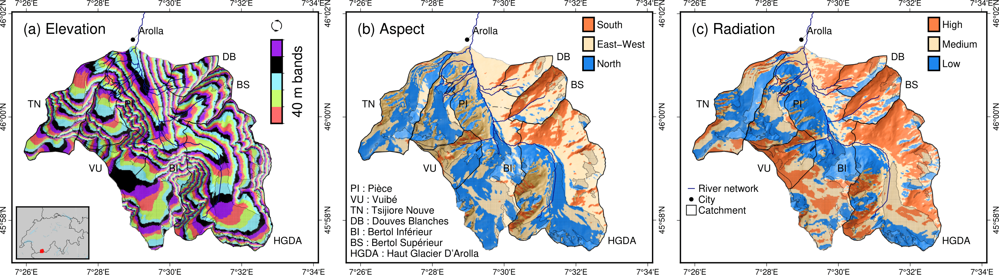

.. _basics:

The basics
==========

Model structure
---------------

Hydrobricks models are built from three kinds of objects: **bricks**,
**processes**, and **fluxes**.

A **brick** is any storage that holds water — a snowpack, a glacier, a soil
reservoir, and so on. Each brick can contain multiple water containers: the
snowpack, for instance, tracks snow and liquid water separately.

A **process** extracts water from a brick. Snowmelt, evapotranspiration (ET),
and reservoir outflow are all processes. Each brick can have one or more
processes assigned to it.

A **flux** carries extracted water somewhere: to another brick, to the
atmosphere, or to the basin outlet. Together, bricks, processes, and fluxes
form a directed water-transport graph that is solved at each time step.

Currently, only pre-built model structures are available. An instance is
created by calling the model class with the desired options:

.. code-block:: python

   socont = models.Socont(soil_storage_nb=2)

The available models and their options are described on the
:ref:`models page <models>`.

.. _inspecting-structure:

Inspecting the structure
~~~~~~~~~~~~~~~~~~~~~~~~~~

The structure of a model can be inspected right after construction (no ``setup()`` or
``run()`` needed). It reflects the complete structure, including the auto-generated parts
(snow routine, precipitation splitters, forest canopy, glacier reservoirs), and each flux
is labelled with the **process** that withdraws the water.

.. code-block:: python

   model = models.HBV96()

   # Textual summary (à la model.summary() in deep-learning frameworks)
   model.print_structure()

   # A serializable graph object
   graph = model.get_structure_graph()
   graph.to_dict()      # nested dict (nodes + edges)
   graph.to_json()      # JSON string
   graph.to_yaml()      # YAML string
   graph.to_dot()       # Graphviz DOT string (no extra dependency)

   # A rendered diagram (requires the optional `graphviz` package)
   model.plot_structure('model_structure', fmt='png')

The diagram can be tuned with several options (also available on
``graph.plot()`` / ``graph.to_dot()``):

.. code-block:: python

   model.plot_structure(
       'model_structure',
       fmt='pdf',           # 'png', 'pdf' or 'svg' ('pdf'/'svg' are vector = sharpest)
       dpi=200,             # raster resolution for PNG (default 150); ignored for vector
       with_forcing=False,  # drop the meteo forcing inputs for a cleaner diagram
       legend=False,        # omit the legend
       nodesep=0.8,         # spacing between nodes in a rank
       ranksep=1.0,         # spacing between ranks
       structure_id=2,      # which structure variant to draw
   )

Models with glacier or lake covers define several structure *variants* (e.g. a
glacier-free base and a with-glacier variant); pass ``structure_id=`` to inspect a
specific one. ``with_forcing`` is also available on ``get_structure_graph()``.

.. _spatial-structure:

Spatial structure
-----------------

.. _catchment-class:

The Catchment object
^^^^^^^^^^^^^^^^^^^^^

:class:`Catchment` is the central object for defining the study area. It is
initialized with a catchment outline shapefile and then provides access to the
DEM, hydro unit properties, and the preprocessing sub-modules:

* ``catchment.topography`` — slope, aspect, hillshade
  (see :ref:`catchment-topography`)
* ``catchment.discretization`` — splitting the catchment into hydro units
  (see :ref:`catchment-discretization`)
* ``catchment.connectivity`` — lateral connectivity between units
  (see :ref:`catchment-connectivity`)
* ``catchment.solar_radiation`` — potential direct solar radiation
  (see :ref:`potential-solar-radiation`)

.. code-block:: python

   import hydrobricks as hb

   catchment = hb.Catchment(outline='path/to/watershed.shp')
   catchment.extract_dem('path/to/dem.tif')

``Catchment`` can also be used as a context manager to ensure file handles are
released automatically when preprocessing is complete:

.. code-block:: python

   with hb.Catchment(outline='path/to/watershed.shp') as catchment:
       catchment.extract_dem('path/to/dem.tif')
       ...

See the :ref:`API reference <api_catchment>` for the full method list.

Hydro units
^^^^^^^^^^^^

The catchment is discretized into sub-units called **hydro units**, which can
represent elevation bands, hydrological response units (HRUs), raster pixels,
or any other spatial partition. Hydro units can be defined in two ways: loaded
from a CSV file, or generated automatically from a DEM.

*Example of discretization of a catchment based on (a) elevation bands,
(b) aspect, and (c) potential solar radiation. Aspect or potential 
solar radiation is then combined with elevation bands to form hydro units. 
Source:* :cite:t:`Argentin2025`

Loading hydro units from a CSV file
""""""""""""""""""""""""""""""""""""

The simplest way to define hydro units is to load them from a CSV file. At
minimum, the file must contain the area and mean elevation of each unit:

.. code-block:: python

   hydro_units = hb.HydroUnits()
   hydro_units.load_from_csv(
      'path/to/file.csv', 
      column_elevation='elevation', 
      column_area='area'
   )

The CSV must have two header rows: the first with column names, the second
with units. A minimal example:

.. code-block:: text
   :caption: Example of a CSV file with hydro unit areas.

   num, elevation, area
   -, m, m^2
   0, 790, 2457500
   1, 840, 4481250
   2, 890, 5630625
   3, 940, 5598125
   4, 990, 4551250
   5, 1040, 4579375
   6, 1090, 4128125
   7, 1140, 4807500
   8, 1190, 4643750
   9, 1240, 4662500
   10, 1290, 4158750
   11, 1340, 3496875
   12, 1390, 2361250

By default, each hydro unit has a single ``open`` land cover. Catchments
with glaciers or other distinct surface types require multiple land covers.
Each land cover has a type (which determines its physical behaviour) and a
name (which distinguishes it from other land covers of the same type).

The available land cover types are:

* ``open`` (aliases ``ground``, ``generic``, ``generic_land_cover``): the default
  soil-bearing surface — the HBV "open areas" class; its behaviour comes entirely from
  the processes the model attaches to it. (``ground`` was the former default and is kept
  as an alias for backward compatibility.)
* ``glacier``: a glacierized surface with ice melt, handled by the model's
  :ref:`glacier module <glacier-modules>` (e.g. draining to dedicated reservoirs).
* ``forest``: a soil-bearing surface that can optionally intercept rain in a canopy
  store (HBV only, enabled with ``forest_interception=True``; see
  :ref:`HBV land covers <hbv-land-covers>`).
* ``lake``: an exclusive open-water surface — all precipitation enters the open water,
  which evaporates at the potential rate and drains through a linear outflow (HBV only).

Which types a given model accepts depends on the model (see :ref:`Models <models>`);
all models support ``open`` and ``glacier``. For example, a catchment with bare-ice
and debris-covered glacier areas uses three land covers:

.. code-block:: python

   land_cover_names = ['open', 'glacier_ice', 'glacier_debris']
   land_cover_types = ['open', 'glacier', 'glacier']

   hydro_units = hb.HydroUnits(land_cover_types, land_cover_names)
   hydro_units.load_from_csv(
      'path/to/file.csv', 
      column_elevation='Elevation',
      columns_areas={
         'open': 'Area Non Glacier',
         'glacier_ice': 'Area Ice',
         'glacier_debris': 'Area Debris'
      }
   )

The CSV must list the area of each land cover per hydro unit
(more information in :ref:`the Python API <api_hydrounits>`):

.. code-block:: text
   :caption: Example of a CSV file with areas for multiple land cover types.

   Elevation, Area Non Glacier, Area Ice, Area Debris
   m, km2, km2, km2
   3986, 2.408, 0, 0
   4022, 2.516, 0, 0
   4058, 2.341, 0, 0.003
   4094, 2.351, 0, 0.006
   4130, 2.597, 0, 0.01
   4166, 2.726, 0, 0.006
   4202, 2.687, 0, 0.061
   4238, 2.947, 0, 0.065
   4274, 2.924, 0.013, 0.06
   4310, 2.785, 0.019, 0.058
   4346, 2.578, 0.052, 0.176
   4382, 2.598, 0.072, 0.369
   4418, 2.427, 0.129, 0.384
   4454, 2.433, 0.252, 0.333
   4490, 2.210, 0.288, 0.266
   4526, 2.136, 0.341, 0.363
   4562, 1.654, 0.613, 0.275

Generating hydro units from a DEM
"""""""""""""""""""""""""""""""""

When spatial data are available, hydro units can be generated automatically
from a DEM, with discretization criteria chosen to match the melt model in use:

* **Elevation only** — sufficient for ``'degree_day'``
* **Elevation + aspect** — required for ``'degree_day_aspect'``
* **Elevation + radiation** — recommended for ``'temperature_index'``

See :ref:`melt models<melt-models>` for a description of each.

The following example discretizes a study area into 50 m elevation bands
combined with aspect classes. The elevation range covers the entire catchment
(1912–2893 m), with some margin added for the bands:

.. code-block:: python

   study_area = catchment.Catchment(outline='path/to/watershed/shapefile.shp')
   success = study_area.extract_dem('path/to/dem.tif')
   study_area.discretize_by(
      ['elevation', 'aspect'],
      elevation_method='equal_intervals',
      elevation_distance=50,
      min_elevation=1900,
      max_elevation=2900,
   )

Discretizing by potential solar radiation
""""""""""""""""""""""""""""""""""""""""""

The ``'temperature_index'`` melt model requires per-unit radiation values.
Hydrobricks computes the daily mean potential clear-sky direct solar radiation
at the DEM surface [W/m²] using the equation of :cite:t:`Hock1999`. The radiation
resolution defaults to the DEM resolution; for high-resolution DEMs, specify
a coarser resolution to keep computation times reasonable.

.. code-block:: python

   study_area = catchment.Catchment(outline='path/to/watershed/shapefile.shp')
   success = study_area.extract_dem('path/to/dem.tif')
   study_area.calculate_daily_potential_radiation('path/to/file', resolution)

Because radiation depends only on topography, not on the simulation year, the
result can be saved to a GeoTIFF and reloaded in future runs. The default
filename is ``'annual_potential_radiation.tif'``:

.. code-block:: python

   study_area = catchment.Catchment(outline='path/to/watershed/shapefile.shp')
   success = study_area.extract_dem('path/to/dem.tif')
   study_area.load_mean_annual_radiation_raster(
      'path/to/file', 
      filename='annual_potential_radiation.tif'
   )

With the radiation loaded, pass it as a discretization criterion:

.. code-block:: python

   study_area.discretize_by(
      ['elevation', 'radiation'],
      elevation_method='equal_intervals',
      elevation_distance=50,
      min_elevation=1900,
      max_elevation=2900,
      radiation_method='equal_intervals',
      radiation_distance=65,
      min_radiation=0,
      max_radiation=260
   )

.. _running:

.. _model-instance:

Running the model
------------------

Once you have defined the :ref:`hydro units <spatial-structure>`,
:ref:`parameters <parameters>`, and :ref:`forcing <forcing-data>`, set up and
run the model:

.. code-block:: python

   socont.setup(
      spatial_structure=hydro_units, 
      output_path='/path/to/dir',
      start_date='1981-01-01', 
      end_date='2020-12-31'
   )

   socont.run(parameters=parameters, forcing=forcing)

The outlet discharge (in mm/d) can then be retrieved:

.. code-block:: python

   sim_ts = socont.get_outlet_discharge()

To export all internal fluxes and states to a NetCDF file for further analysis:

.. code-block:: python

   socont.dump_outputs('/output/dir/')

Initializing state variables
^^^^^^^^^^^^^^^^^^^^^^^^^^^^^

By default, all water storages (snowpack, soil reservoirs, etc.) start empty at
the beginning of the simulation. To initialize them to more realistic values,
call ``initialize_state_variables()`` between ``setup()`` and ``run()``:

.. code-block:: python

   socont.initialize_state_variables(
      parameters=parameters, 
      forcing=forcing
   )
   socont.run(parameters=parameters, forcing=forcing)

This runs the model once over the full simulation period, captures the final
storage values, and uses them as the starting point for subsequent runs. When
the model is run multiple times — as during calibration — it resets to these
saved values at the start of each run rather than to empty reservoirs.

Warmup period
^^^^^^^^^^^^^^

Even with ``initialize_state_variables()``, the very first years of a
simulation are typically unreliable because the storages have not yet settled
into a realistic seasonal cycle. This initial period is called the **warmup**
or **spin-up** period, and it is conventionally set to one or two years.

During the warmup, snow accumulation and discharge are usually underestimated
because the snowpack starts from the previous season's final state, which may
not match the actual initial conditions. For this reason, the warmup years
should be excluded from evaluation, calibration, and analysis. The calibration
setup accepts a ``warmup`` argument for this purpose — see the
:ref:`calibration page <calibration>`.

Evaluation
^^^^^^^^^^^

After a run, performance metrics can be computed by comparing the simulated
discharge to observations. Load observations from a CSV file (discharge in
mm/d):

.. code-block:: python

   obs = hb.Observations()
   obs.load_from_csv(
      '/path/to/obs.csv', 
      column_time='Date', 
      time_format='%d/%m/%Y',
      content={'discharge': 'Discharge (mm/d)'}
   )
   obs_ts = obs.data[0]

   nse = socont.eval('nse', obs_ts)
   kge_2012 = socont.eval('kge_2012', obs_ts)

Metrics are provided by the `HydroErr package <https://hydroerr.readthedocs.io>`_.
Any metric from their
`full list <https://hydroerr.readthedocs.io/en/stable/list_of_metrics.html>`_
can be used by passing its function name as a string.

Outputs
-------

Results are available at three levels of detail:

1. `Direct outputs`_ — scalar or time-series summaries available immediately
   after a run.
2. A `NetCDF output file`_ — per-hydro-unit fluxes and states, exported on
   demand.
3. :ref:`Auxiliary files <others>` — spatialized forcing, log files, and
   calibration records.

Direct outputs
^^^^^^^^^^^^^^

The following outputs are accessible on the model object after a run:

**Time series:**

* ``get_outlet_discharge()``: daily discharge at the basin outlet (mm/d)

**Integrated totals over the simulation period:**

* ``get_total_outlet_discharge()``: total discharge at the outlet
* ``get_total_et()``: total evapotranspiration
* ``get_total_water_storage_changes()``: net change in total water storage
  from the start to the end of the simulation
* ``get_total_snow_storage_changes()``: net change in snow storage

.. _netcdf-output-file:

NetCDF output file
^^^^^^^^^^^^^^^^^^

A detailed NetCDF file is exported with ``model.dump_outputs('some/path')``.
How much data it contains depends on the ``record_all`` option set at model
creation:

* ``record_all=False`` (default): only outlet discharge and a few selected
  time series are stored. Use this during calibration.
* ``record_all=True``: every flux and state variable is recorded at every
  time step. This is useful for diagnosing model behaviour but slows execution
  and produces large files.

**File structure**

Dimensions:

* ``time``: the temporal axis
* ``hydro_units``: one entry per hydro unit (e.g., per elevation band)
* ``aggregated_values``: catchment-scale (lumped) quantities
* ``distributed_values``: per-hydro-unit quantities
* ``land_covers``: one entry per land cover

Global attributes that map variable indices to names:

* ``labels_aggregated``: names of lumped elements (fluxes and states)
* ``labels_distributed``: names of distributed elements
* ``labels_land_covers``: names of land covers

To inspect the available labels:

.. code-block:: python

   results = hb.Results('path/to/netcdf_results_file')
   print(results.results.attrs)

Example output for GSM-Socont with two glacier types:

.. code-block:: text

   labels_aggregated =
      "glacier_area_rain_snowmelt_storage:content",
      "glacier_area_rain_snowmelt_storage:outflow:output",
      "glacier_area_icemelt_storage:content",
      "glacier_area_icemelt_storage:outflow:output",
      "outlet";

   labels_distributed =
      "open:content",
      "open:infiltration:output",
      "open:runoff:output",
      "glacier_ice:content",
      "glacier_ice:outflow_rain_snowmelt:output",
      "glacier_ice:melt:output",
      "glacier_debris:content",
      "glacier_debris:outflow_rain_snowmelt:output",
      "glacier_debris:melt:output",
      "open_snowpack:content",
      "open_snowpack:snow",
      "open_snowpack:melt:output",
      "glacier_ice_snowpack:content",
      "glacier_ice_snowpack:snow",
      "glacier_ice_snowpack:melt:output",
      "glacier_debris_snowpack:content",
      "glacier_debris_snowpack:snow",
      "glacier_debris_snowpack:melt:output",
      "slow_reservoir:content",
      "slow_reservoir:et:output",
      "slow_reservoir:outflow:output",
      "slow_reservoir:percolation:output",
      "slow_reservoir:overflow:output",
      "slow_reservoir_2:content",
      "slow_reservoir_2:outflow:output",
      "surface_runoff:content",
      "surface_runoff:outflow:output";

   labels_land_covers =
      "open",
      "glacier_ice",
      "glacier_debris";

**Variables in the file:**

* ``time`` (1D): dates as Modified Julian Dates (days since 1858-11-17 00:00)
* ``hydro_units_ids`` (1D): IDs of the hydro units
* ``hydro_units_areas`` (1D): area of each hydro unit [m²]
* ``sub_basin_values`` (2D): lumped time series, indexed by ``labels_aggregated``
* ``hydro_units_values`` (2D): distributed time series, indexed by
  ``labels_distributed``. Two important subtypes:

  * **Flux variables** (names ending in ``:output``, unit: mm): already weighted
    by land cover fraction and relative hydro unit area. You can sum them
    directly over all hydro units to get the catchment-total contribution of a
    component (e.g., total glacier melt).
  * **State variables** (names ending in ``:content`` or ``:snow``, unit: mm):
    the water depth stored in a reservoir. These are *not* area-weighted — to
    aggregate over the catchment, multiply each value by its land cover fraction
    and relative hydro unit area.

* ``land_cover_fractions`` (2D, optional): time series of land cover fractions,
  present when glacier or other land cover evolution is active.

.. _others:

Auxiliary outputs
^^^^^^^^^^^^^^^^^

* **Spatialized forcing** (``forcing.nc``): the per-unit forcing time series,
  saved with ``forcing.create_file()``. Useful for inspecting what the model
  actually received as input.
* **Log files** (``hydrobricks_...log``): execution logs that record warnings
  and errors, useful for debugging.
* **Hydro units raster** (``hydro_units.tif``): a GeoTIFF with unit IDs as
  pixel values, useful for spatial visualization.
* **Hydro units table** (``hydro_units.csv``): unit properties (elevation,
  area, land cover fractions) in tabular form.
* **Annual radiation raster** (``annual_potential_radiation.tif``): potential
  clear-sky solar radiation, saved during preprocessing.
* **Calibration records**: SPOTPY saves every model evaluation to CSV or SQL
  during calibration.
