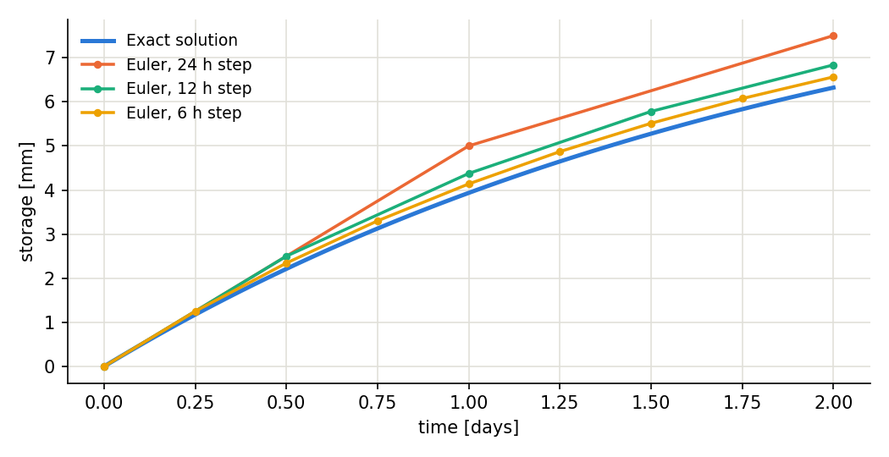
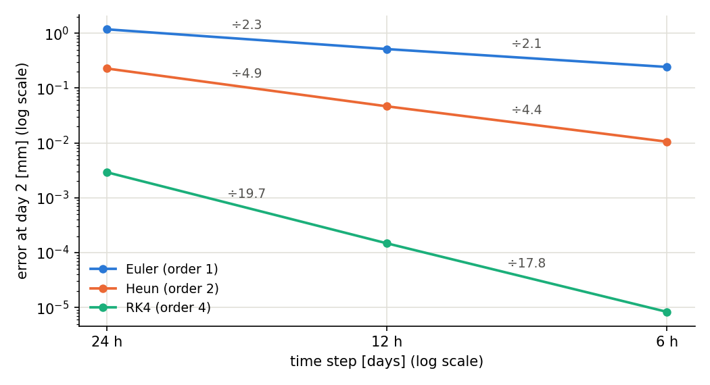
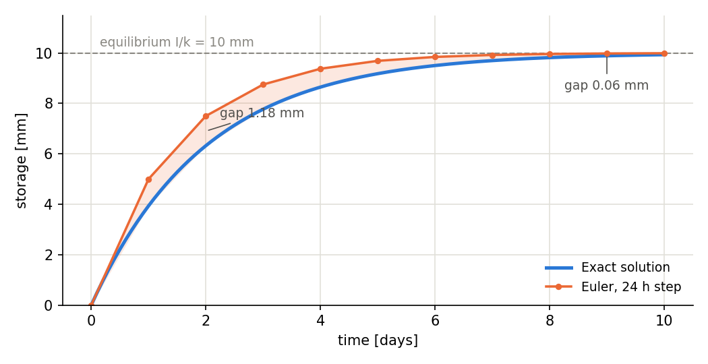

.. _solvers:

Numerical solvers
=================

The reservoirs of a model structure (soil storages, groundwater reservoirs,
routing stores) form a system of ordinary differential equations (ODEs) of the
form :math:`\mathrm{d}S/\mathrm{d}t = I - Q(S)`, where :math:`S` is the storage
content, :math:`I` the inflow and :math:`Q(S)` the content-dependent outflow.
The numerical solver integrates this system over each time step. The solver is
selected at model instantiation:

.. code-block:: python

   socont = models.Socont(solver="heun_explicit")  # the default

Available solvers
-----------------

.. list-table::
   :header-rows: 1
   :widths: 22 12 14 52

   * - Name
     - Order
     - RHS eval. / step
     - Properties
   * - ``euler_explicit``
     - 1
     - 1
     - Fastest; least accurate; can become unstable for fast-reacting
       reservoirs (see :ref:`stability <solver-stability>`).
   * - ``heun_explicit`` (default)
     - 2
     - 2
     - Good accuracy/cost compromise for daily simulations.
   * - ``runge_kutta`` (or ``rk4``)
     - 4
     - 4
     - Most accurate of the explicit schemes for smooth dynamics; the extra
       cost rarely pays off when thresholds or storage limits are active.
   * - ``analytic_linear`` (or ``analytic``)
     - exact
     - 1
     - Integrates linear reservoirs exactly (see
       :ref:`below <analytic-solver>`); unconditionally stable; no transit
       lag through reservoir cascades.

The first three are classic explicit Runge–Kutta schemes: they evaluate the
outflow rates at one or more intermediate states and advance all the solved
reservoirs together as one coupled system. The analytic solver follows a
different strategy described below.

How a time step is computed
---------------------------

Within each time step, the computation proceeds in two phases:

1. **Direct phase.** The surface elements (land covers, snowpacks, glaciers —
   in general everything marked as computed directly) are processed
   sequentially, in the order of their declaration. Their outputs (melt,
   infiltration, runoff) are booked as inputs to the reservoirs below.
2. **Solver phase.** The reservoirs are then integrated over the time step by
   the selected solver, receiving the surface outputs of the current step.

This split keeps threshold-type surface processes (rain/snow partition, melt
switching on and off) out of the ODE system, which the solver can then treat
as smooth dynamics.

.. _analytic-solver:

The analytic solver
-------------------

For a reservoir with a linear outflow (``outflow:linear``,
:math:`Q = k\,S`) and an inflow held constant over the step, the ODE has a
closed-form solution:

.. math::

   S(t+h) = S(t)\,e^{-kh} + \frac{I}{k}\left(1 - e^{-kh}\right),

with the outflow volume following from mass balance,
:math:`V_\mathrm{out} = I\,h - \left(S(t+h) - S(t)\right)`.
The ``analytic_linear`` solver uses this solution directly. It processes the
reservoirs one by one in declaration order (upstream before downstream); each
reservoir receives the upstream outflow of the *same* step as a constant
inflow rate. Processes that are not linear in the content (e.g. evapotranspiration)
are accounted for with their rate evaluated at the start of the step.

This gives the analytic solver three properties the explicit schemes lack:

* **Exactness** for linear reservoirs, at any time step — the results do not
  change when the time step is refined.
* **Unconditional stability** — fast-reacting reservoirs (large
  :math:`k\,h`) cannot destabilize it.
* **No transit lag** — water entering an empty reservoir contributes to its
  outflow within the same step, and a cascade of reservoirs responds within
  one step. With explicit schemes, the outflow of a reservoir only reacts to
  inflows one (Euler) or a fraction of a step later; a rainfall pulse
  therefore needs several steps to traverse a cascade.

Two restrictions apply:

* Reservoirs with a maximum capacity must have an overflow process attached
  (this is verified at initialization); the capacity excess is routed through
  the overflow.
* Only outflows declared as linear are integrated exactly; other processes on
  the same reservoir are approximated with their start-of-step rate. For
  strongly non-linear reservoirs (e.g. the Socont quick-runoff store), the
  analytic solver degrades to a first-order approximation for that store.

Accuracy and the time step
--------------------------

Every discrete scheme carries a *discretization error* that shrinks as a power
of the time step :math:`h`:

.. math::

   \text{error} \approx C\,h^p,

where :math:`p` is the **order** of the scheme. Halving the time step divides
the error by :math:`2^p`: by ~2 for Euler, ~4 for Heun and ~16 for RK4. The
following figures illustrate this on a linear reservoir
(:math:`k = 0.5\,\mathrm{d^{-1}}`, initially empty) filling under a constant
rain of 5 mm/d — a problem with a known exact solution.

   The exact solution and the explicit Euler approximation at 24 h, 12 h and
   6 h steps. Each step holds the start-of-step outflow constant, so coarser
   steps overshoot the exact curve; each halving of the step roughly halves
   the gap (1.18 → 0.51 → 0.24 mm at day 2) — the signature of a first-order
   scheme.

   The day-2 error against the step size on log–log axes, where
   :math:`\text{error} \approx C\,h^p` appears as a straight line of slope
   :math:`p`. The printed factors are the measured error ratios per halving:
   ~2 for Euler, ~4 for Heun, ~16 for RK4. The ratios sit slightly above the
   nominal :math:`2^p` at coarse steps (where higher-order terms still
   contribute) and approach it as the step shrinks.

Two practical consequences:

* **Discretization errors live in the transients.** They are largest while
  the storages are rising or falling quickly — that is, around flood peaks —
  and vanish near equilibrium, where inflow balances outflow and every scheme
  finds the same steady state (see below). If low-flow periods look right but
  peaks are damped or delayed, the time step or the solver order may be the
  cause.
* **A higher order only pays off for smooth dynamics.** When storage limits
  or thresholds are active during a step, all schemes degrade locally; RK4's
  fourth order is only realized away from such events.

   The same reservoir over ten days: the exact solution and the Euler
   approximation both converge to the equilibrium
   :math:`I/k = 10` mm, and the gap between them fades from 1.18 mm at day 2
   to 0.06 mm at day 10. Discretization errors matter during the transient,
   not at steady state.

.. _solver-stability:

Stability
---------

Explicit schemes are only conditionally stable: for a linear reservoir,
explicit Euler oscillates when :math:`k\,h > 1` and diverges when
:math:`k\,h > 2`. With daily steps, this concerns fast-reacting reservoirs
with response factors approaching :math:`1\,\mathrm{d^{-1}}` and beyond. If a
calibration explores such values, prefer ``heun_explicit`` (wider stability
margin) or ``analytic_linear`` (unconditionally stable), or reduce the time
step.

Verification
------------

The behaviour documented here is enforced by the test suite of the
computational core: convergence tests run the schemes at 24 h, 12 h and 6 h
steps against the analytic solution and assert the error ratios above (a
scheme whose implementation silently lost its order would fail them), and the
analytic solver is verified against the closed-form solution and for exact
mass-balance closure.
